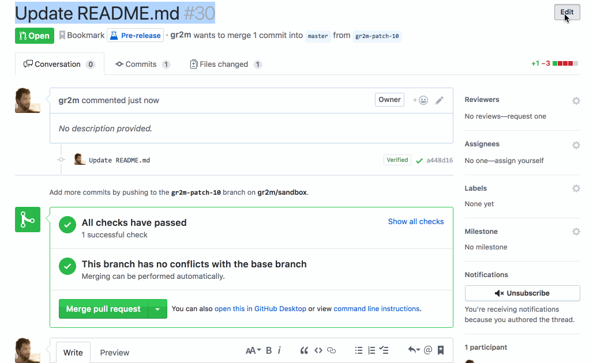

# wip-bot

[](https://stats.uptimerobot.com/Dq46zf6PY) [](https://greenkeeper.io/)

> DO NOT MERGE – as a service.



## Usage

1. Install the app on your GitHub Repositories: [github.com/apps/wip](https://github.com/apps/wip)
2. The WIP bot sets status of the request title to pending if it finds  "wip" or "do not merge" (not case-sensitive) in
   1. The pull request title
   2. One of the pull request labels
   3. One of the pull request commit messages
3. If it doesn’t find the words anywhere, it will set status to success

## Local setup

- Setup repository

  ```
  git clone git@github.com:gr2m/wip-bot.git
  cd wip-bot
  npm install
  ```
- Create your own GitHub app: [instructions](https://probot.github.io/docs/development/#configure-a-github-app)
- Store the private key as `private-key.pem` in the repository’s directory
- Start the app with `APP_ID=1234 npm start` where `1234` is your GitHub App’s ID
- update your GitHub App’s `Webhook URL` to your localtunnel.me URL

## Contribute

If you’d like to contribute a bug fix or feature to `wip-bot`, please fork the repository, then clone it to your computer. Then install dependencies and run the tests 

```
npm install
npm test
```

Before adding a feature, create an issue first to ask if it’s within the scope of the app. If possible, add tests to your pull requests.

## License

[Apache 2.0](LICENSE)
